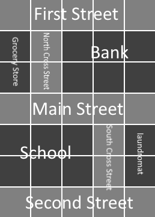
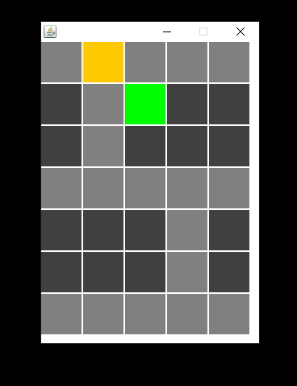

# Town-Simulator
Programming challenge. Given the API documentation for a simulation of a town, define a method, travel(), for a corresponding class,
Vehicle, that will navigate the town, seeking a target location randomly selected by the simulator at run time.

## Official Challenge Description
Given the Java class files Simulator.class, Town.class, and Display.class define the Vehicle class having a method with
the following signature: 

```public void travel()```

that provides the functionality to allow and instance of Vehicle (instantiated by the Simulator class file) to navigate the town 
described below. The Simulator proceeds step by step calling the ```travel()``` method once every second, so any code in ```travel()```
should be designed to navigate the vehicle one step at a time until the target is reached. Simulation runs repeatedly until window is 
closed.

### Town Map



## Simulator Running



The Simulator prints messages to the console as it runs. These messages indicate the location of the vehicle as it navigates and 
may assist in writing and debugging the Vehicle class. In the example above the vehicle is represented by the orange square, the goal
by the green, streets by the light gray squares, and buildings by dark gray. In the example, the vehicle drives past the goal and 
crashes at the end of First Street; the crash state is indicated by the vehicle turning red.

The messages printed to the console during this example run of the Simulator looked like this:
```
Continuing on First Street.
Continuing on First Street.
Continuing on First Street.
Crashed on First Street.
```

# API Documentation
## public class Simulator
### Methods:
**public String get_location()**<br/>
  Returns current location of vehicle as a String.<br/>
  
**public String get_goal()**<br/>
  Returns target location set at run time as a String.<br/>
  
**public String look_ahead(String direction)**<br/>
  Takes as an argument a cardinal direction: "NORTH", "SOUTH", "EAST", "WEST". Returns the location one step ahead as a String.<br/>
  
**public void drive(String direction)**<br/>
  Accepts as an argument a cardinal direction to look: "NORTH", "SOUTH", "EAST", "WEST". Moves the vehicle in the direction indicated in the 
  argument.<br/>
  
### Samples:

if location is currently somewhere on Main Street the following prints **"Main Street"**.
```
Simulator simulator = new Simulator();
current_location = simulator.get_location()
System.out.println(current_location); 
```
If location just ahead in the direction given is off the map or a location that would result in a crash, such as a building, 
the following prints **"Invalid Location"**.
```
Simulator simulator = new Simulator();
looking_west = simulator.look_ahead("WEST")
System.out.println(looking_west); 
```

